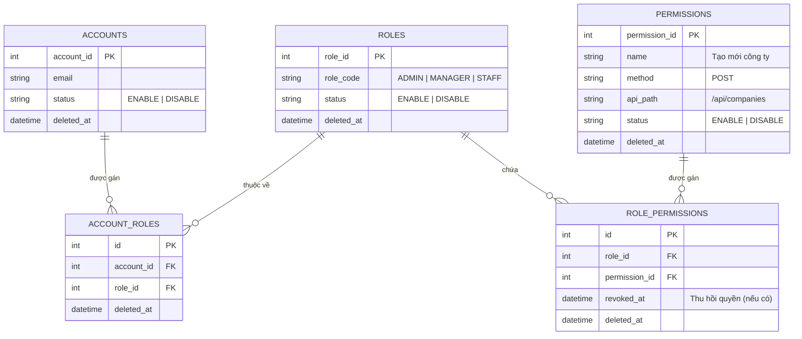

# RBAC — Role-Based Access Control & Dynamic Route Authorization

> Quy trình thiết kế, triển khai và kiểm thử hệ thống Phân quyền theo Vai trò (RBAC) kết hợp Phân quyền Động theo API/Route — độc lập với backend, độc lập với frontend.
> Áp dụng cho các hệ thống web app, ứng dụng di động, API microservices và các công cụ CRM/ERP nội bộ.

---

## 1. RBAC là gì?

**Role-Based Access Control (RBAC)** = Cấp quyền hạn truy cập dựa trên VAI TRÒ (ROLE) của người dùng thay vì gán trực tiếp từng quyền cho cá nhân.

```
Người dùng (User)  →  Vai trò (Role)  →  Quyền hạn (Permission)  →  Phương thức (Method) × Route API (Path)
    (Ai)                   (Vai trò)         (Có quyền gì)                     (Trên Endpoint nào)
```

### So sánh các mô hình Phân quyền

| Mô hình | Khi nào nên dùng | Ví dụ |
|---|---|---|
| **ACL** (Access Control List) | Ứng dụng nhỏ, ít người dùng, quyền hạn cá nhân hóa cao | `userId=42 có thể chỉnh sửa project=99` |
| **RBAC** ⭐ | Ứng dụng vừa và lớn, vai trò rõ ràng, dễ quản lý & kiểm toán | `role=manager có thể gọi PUT /api/companies/:id` |
| **ABAC** (Attribute-Based) | Phân quyền phụ thuộc vào ngữ cảnh động (thời gian, IP, chủ sở hữu) | `chỉ sửa được nếu là chủ sở hữu + trong giờ hành chính` |
| **ReBAC** (Relationship-Based) | Mạng xã hội, hệ thống chia sẻ tập tin | `bạn của bạn có thể xem bài viết` |

**Nguyên tắc**: Mặc định sử dụng **RBAC động theo Route/API**. Đơn giản, auditable, mở rộng tốt. Khi RBAC chưa đủ đáp ứng → kết hợp thêm kiểm tra phạm vi ABAC (ví dụ: `hasPermission + isOwner`) ở level controller/service.

---

## 2. Các Khái Niệm Cốt Lõi

### 2.1. Tài khoản (User / Account)
Một cá nhân hoặc tài khoản dịch vụ (service account) đăng nhập vào hệ thống. Một người dùng có thể được gán một hoặc nhiều **Vai trò (Roles)**.

### 2.2. Vai trò (Role)
Một tập hợp định danh đại diện cho chức vụ/nhóm quyền trong hệ thống. **Không bao giờ gán trực tiếp API path cho User** — luôn thông qua Role.
- `super_admin` — Toàn quyền hệ thống (chỉ 1-2 tài khoản root). Bypass qua tất cả bước kiểm tra quyền.
- `admin` — Quản trị viên vận hành hệ thống.
- `manager` / `staff` — Nhân viên quản lý / nhân viên nghiệp vụ.
- `user` / `customer` — Người dùng cuối / Khách hàng.

### 2.3. Quyền hạn (Permission) & Định dạng API/Route
Một quyền hạn quy định rõ **Phương thức HTTP (HTTP Method)** và **Đường dẫn API (API Path)** mà tài khoản được phép thực thi.

Định dạng chuẩn:
```
<METHOD> <API_PATH>
```

Ví dụ trong Database:
- `GET /api/companies` — Lấy danh sách công ty
- `GET /api/companies/:id` — Lấy chi tiết 1 công ty
- `POST /api/companies` — Tạo mới công ty
- `PUT /api/companies/:id` — Cập nhật thông tin công ty
- `DELETE /api/companies/:id` — Xóa công ty

---

## 3. Cấu Trúc Cơ Sở Dữ Liệu Phân Quyền Động (Database Schema)

Để hỗ trợ phân quyền động theo từng Route API, cơ sở dữ liệu cần các bảng cốt lõi sau:



---

## 4. Quy Trình Phân Quyền Theo API / Route (API/Route Authorization Flow)

### 4.1. Quy chuẩn Đặt tên API & Route (RESTful)
Tất cả các route phải tuân thủ RESTful Naming Convention để hệ thống phân quyền tự động so khớp đường dẫn:
- Dùng **danh từ số nhiều** (`/api/companies`, `/api/employees`, `/api/branches`).
- Tham số biến đổi động trên URL phải đặt dạng `:id`, `:companyId`, `:employeeId`.
- Sử dụng HTTP Method làm hành động (`GET`, `POST`, `PUT`, `PATCH`, `DELETE`).

### 4.2. Luồng Xử Lý Của Middleware Phân Quyền Động (`dynamicPermissionMiddleware`)

Khi có request từ Client gửi lên, quy trình kiểm tra quyền diễn ra qua 5 bước:

```mermaid
flowchart TD
    A[Client gửi Request: METHOD + PATH] --> B{Xác thực JWT?}
    B -- Không --> C[Trả về 401 Unauthorized]
    B -- Có (Lấy accountId) --> D{AccountId == 1 (SuperAdmin)?}
    D -- Có --> E[Bypass: Cho phép truy cập (next)]
    D -- Không --> F[Truy vấn DB: Lấy danh sách Quyền active của User]
    F --> G{Tài khoản / Role active?}
    G -- Không --> H[Trả về 403 Forbidden]
    G -- Có --> I[Chuyển apiPath trong DB thành Regex: :id -> [^/]+]
    I --> J{So khớp Method & Regex Path?}
    J -- Không khớp --> H[Trả về 403 Forbidden]
    J -- Khớp --> K[Cho phép đi tiếp (next)]
```

### 4.3. Thuật Toán So Khớp Route Động (Dynamic Route Matching Logic)

Ví dụ đoạn mã triển khai Middleware phân quyền động trong Node.js / Express:

```javascript
export const dynamicPermissionMiddleware = async (req, res, next) => {
  try {
    const accountId = req.user?.userId
    const currentMethod = req.method.toUpperCase()
    
    // Chuẩn hóa currentPath (Loại bỏ dấu / ở cuối)
    let currentPath = (req.baseUrl || '') + (req.path || '')
    if (currentPath.endsWith('/') && currentPath.length > 1) {
      currentPath = currentPath.slice(0, -1)
    }

    if (!accountId) {
      return res.status(401).json({ success: false, message: 'Chưa được xác thực.' })
    }

    // 1. Super Admin (accountId = 1) -> Bypass toàn bộ kiểm tra
    if (Number(accountId) === 1) {
      return next()
    }

    // 2. Lấy danh sách tất cả các quyền hợp lệ của User từ DB (Hợp nhất các Role)
    const userPermissions = await getUserActivePermissions(accountId)

    // 3. So khớp động URL và HTTP Method
    const hasPermission = userPermissions.some(permission => {
      if (!permission.apiPath || !permission.method) return false

      // Chuẩn hóa DB Path
      let dbPath = permission.apiPath.trim()
      if (dbPath.endsWith('/') && dbPath.length > 1) {
        dbPath = dbPath.slice(0, -1)
      }

      // Chuyển đổi các URL Parameter dạng :id, :companyId thành Regex matcher [^/]+
      const pathPattern = dbPath
        .replace(/[.+^${}()|[\]\\]/g, '\\$&') // Escape regex special chars
        .replace(/:[a-zA-Z0-9_]+/g, '[^/]+')  // Biến :id thành Regex

      const regExp = new RegExp(`^${pathPattern}$`, 'i')

      const methodMatches = permission.method.toUpperCase() === currentMethod
      const pathMatches = regExp.test(currentPath) || currentPath === dbPath

      return methodMatches && pathMatches
    })

    if (!hasPermission) {
      return res.status(403).json({
        success: false,
        message: 'Tài khoản không được cấp phép thực hiện hành động này trên API.'
      })
    }

    next()
  } catch (error) {
    return res.status(500).json({ success: false, message: 'Lỗi hệ thống khi kiểm tra quyền hạn.' })
  }
}
```

### 4.4. Đăng Ký Middleware Vào Router Phân Cấp
Gắn middleware vào router tổng trước các API routes cần bảo vệ:

```javascript
import express from 'express'
import { authMiddleware } from '../middleware/auth.middleware.js'
import { dynamicPermissionMiddleware } from '../middleware/permission.middleware.js'
import { companyRoutes } from '../modules/company/company.routes.js'

const Router = express.Router()

// Đăng ký Middleware bảo vệ Token & Phân quyền động trước Router module
Router.use('/companies', authMiddleware, dynamicPermissionMiddleware, companyRoutes)

export const APIs_Routes = Router
```

---

## 5. Kết Hợp Phạm Vi ABAC Khi Cần Thiết (Data-Level Access)

RBAC kiểm tra xem người dùng có quyền gọi **API endpoint** đó hay không. Tuy nhiên, với một số API (ví dụ: Chỉnh sửa hồ sơ cá nhân hoặc xem công ty của chính mình), cần kết hợp thêm **ABAC Check** ở tầng Controller / Service:

```javascript
async function updateEmployeeHandler(req, res) {
  const currentUserId = req.user.userId
  const targetEmployeeId = req.params.id

  // 1. RBAC Middleware đã thông qua (User có quyền 'PUT /api/employees/:id')
  
  // 2. ABAC Check: Kiểm tra quyền sở hữu dữ liệu
  const isSelf = String(currentUserId) === String(targetEmployeeId)
  const isManager = req.user.roles.includes('ADMIN') || req.user.roles.includes('MANAGER')

  if (!isSelf && !isManager) {
    return res.status(403).json({ success: false, message: 'Bạn chỉ có quyền sửa thông tin của chính mình.' })
  }

  // 3. Thực thi nghiệp vụ...
}
```

---

## 6. Triển Khai Phía Frontend — UI Gate (Cổng Giao Diện)

Frontend tự động ẩn/hiện các nút bấm, menu hoặc bảo vệ Route dựa trên danh sách quyền truy cập trả về từ API `/api/auth/me`.

### 6.1. Hook `usePermission`
```javascript
export function usePermission() {
  const { user } = useAuth()

  return {
    can: (method, apiPath) => {
      if (user?.roles?.includes('SUPER_ADMIN') || user?.id === 1) return true
      return user?.permissions?.some(
        p => p.method.toUpperCase() === method.toUpperCase() && p.apiPath === apiPath
      )
    },
    hasRole: (roleCode) => user?.roles?.includes(roleCode)
  }
}
```

### 6.2. Ẩn/Hiện UI theo Quyền API
```jsx
function CompanyList() {
  const { can } = usePermission()

  return (
    <div>
      {can('POST', '/api/companies') && (
        <Button onClick={handleCreate}>Tạo Công Ty Mới</Button>
      )}

      {can('DELETE', '/api/companies/:id') && (
        <Button danger onClick={handleDelete}>Xóa</Button>
      )}
    </div>
  )
}
```

---

## 7. Ma Trận Kịch Bản Kiểm Thử Phân Quyền (RBAC Test Matrix)

Dưới đây là bộ Test Cases toàn diện để kiểm thử tự động (Integration Testing) và kiểm thử thủ công cho hệ thống RBAC:
Khi sử lý cần check token và user_id xem có quyền không nêu ko có quyền trả về ngay lập tức tránh tình trạng query nhiều.

| Mã TC | Tên Kịch Bản Kiểm Thử | Điều Kiện Đầu Vào (Input) | Kết Quả Kỳ Vọng (Expected) | HTTP Status |
|---|---|---|---|---|
| **TC-RBAC-01** | **Chưa xác thực (Missing Token)** | Gửi request `GET /api/companies` không có Token | Trả về message `Missing token` | `401 Unauthorized` |
| **TC-RBAC-02** | **Super Admin Access (Bypass)** | Account `id = 1` gọi bất kỳ API nào | Luôn đi tiếp thành công (Pass) | `200 OK` |
| **TC-RBAC-03** | **Khớp Exact Path & Method thành công** | User có quyền `POST /api/companies`, gọi `POST /api/companies` | Cho phép đi tiếp, tạo dữ liệu | `200 OK` / `201 Created` |
| **TC-RBAC-04** | **Khớp Parameter Path động thành công** | User có quyền `PUT /api/companies/:id`, gọi `PUT /api/companies/99` | Middleware Regex match `:id` -> pass | `200 OK` |
| **TC-RBAC-05** | **Không có quyền trên Route (Forbidden)** | User KHÔNG được gán quyền `DELETE /api/companies/:id`, gọi `DELETE /api/companies/99` | Trả về `Tài khoản không được cấp phép...` | `403 Forbidden` |
| **TC-RBAC-06** | **Sai HTTP Method (Method Mismatch)** | User chỉ có quyền `GET /api/companies`, nhưng gọi `POST /api/companies` | Bị từ chối kiểm tra Method | `403 Forbidden` |
| **TC-RBAC-07** | **Quyền bị thu hồi (`revokedAt`)** | Record `ROLE_PERMISSIONS` có `revokedAt <= CURRENT_TIMESTAMP` | Trái phép, không lấy quyền này | `403 Forbidden` |
| **TC-RBAC-08** | **Role hoặc Permission bị vô hiệu hóa** | `ROLES` hoặc `PERMISSIONS` có `status = 'DISABLE'` | Bị loại bỏ khỏi danh sách quyền | `403 Forbidden` |
| **TC-RBAC-09** | **Role / Permission bị xóa mềm (`deletedAt`)** | Record có `deletedAt != null` | Bị loại bỏ khỏi danh sách quyền | `403 Forbidden` |
| **TC-RBAC-10** | **Hợp nhất nhiều Role (Multi-role Union)** | User được gán Role A (`GET /api/companies`) & Role B (`POST /api/companies`) | User thực hiện được cả GET và POST | `200 OK` |
| **TC-RBAC-11** | **Cập nhật quyền động tức thì** | Admin vừa gán thêm quyền cho User trong DB | Request tiếp theo của User thành công ngay mà KHÔNG cần relogin | `200 OK` |
| **TC-RBAC-12** | **Route API không tồn tại trong DB PERMISSIONS** | User gọi API chưa từng được đăng ký trong bảng `PERMISSIONS` | Mặc định chặn (Default Deny) | `403 Forbidden` |

---

## 8. Script Đồng Bộ Toàn Bộ API Routes Vào Database

Viết script quét tự động toàn bộ route đã đăng ký, lưu vào bảng `PERMISSIONS` trong lần khởi tạo đầu tiên. Khi bổ sung module mới → chạy lại script để update.

### 8.1. Quy tắc đặt tên Permission

Mỗi record trong bảng `PERMISSIONS` gồm 2 cột chính: **`method`** (HTTP Method) và **`apiPath`** (đường dẫn API). Convention này **khớp trực tiếp** với logic so khớp trong `dynamicPermissionMiddleware`.

#### Quản lý Tổ chức

| Method | API Path | Mô tả |
|---|---|---|
| `GET` | `/api/companies` | Danh sách công ty |
| `POST` | `/api/companies` | Tạo công ty |
| `PUT` | `/api/companies/:id` | Cập nhật công ty |
| `DELETE` | `/api/companies/:id` | Xóa công ty |
| `GET` | `/api/organizations` | Danh sách đơn vị tổ chức |
| `POST` | `/api/organizations` | Tạo đơn vị tổ chức |
| `PUT` | `/api/organizations/:id` | Cập nhật đơn vị tổ chức |
| `DELETE` | `/api/organizations/:id` | Xóa đơn vị tổ chức |
| `GET` | `/api/branches` | Danh sách chi nhánh |
| `POST` | `/api/branches` | Tạo chi nhánh |
| `PUT` | `/api/branches/:id` | Cập nhật chi nhánh |
| `DELETE` | `/api/branches/:id` | Xóa chi nhánh |
| `GET` | `/api/positions` | Danh sách chức vụ |
| `POST` | `/api/positions` | Tạo chức vụ |
| `POST` | `/api/positions/import-preview` | Xem trước import chức vụ |
| `POST` | `/api/positions/import-confirm` | Xác nhận import chức vụ |
| `PUT` | `/api/positions/:id` | Cập nhật chức vụ |
| `DELETE` | `/api/positions/:id` | Xóa chức vụ |

#### Quản lý Nhân sự

| Method | API Path | Mô tả |
|---|---|---|
| `GET` | `/api/employees` | Danh sách nhân viên |
| `POST` | `/api/employees` | Tạo nhân viên |
| `POST` | `/api/employees/import-preview` | Xem trước import nhân viên |
| `POST` | `/api/employees/import-confirm` | Xác nhận import nhân viên |
| `PUT` | `/api/employees/:id` | Cập nhật nhân viên |
| `DELETE` | `/api/employees/:id` | Xóa nhân viên |
| `GET` | `/api/viettel-employees` | Danh sách NV Viettel |
| `POST` | `/api/viettel-employees` | Tạo NV Viettel |
| `PUT` | `/api/viettel-employees/:id` | Cập nhật NV Viettel |
| `DELETE` | `/api/viettel-employees/:id` | Xóa NV Viettel |
| `GET` | `/api/viettel-branches` | Danh sách CN Viettel |
| `POST` | `/api/viettel-branches` | Tạo CN Viettel |
| `PUT` | `/api/viettel-branches/:id` | Cập nhật CN Viettel |
| `DELETE` | `/api/viettel-branches/:id` | Xóa CN Viettel |

#### Quản lý Mạng

| Method | API Path | Mô tả |
|---|---|---|
| `GET` | `/api/vlans` | Danh sách VLAN |
| `POST` | `/api/vlans` | Tạo VLAN |
| `PUT` | `/api/vlans/:id` | Cập nhật VLAN |
| `DELETE` | `/api/vlans/:id` | Xóa VLAN |
| `GET` | `/api/ip-addresses` | Danh sách IP |
| `POST` | `/api/ip-addresses` | Tạo IP |
| `PUT` | `/api/ip-addresses/:id` | Cập nhật IP |
| `DELETE` | `/api/ip-addresses/:id` | Xóa IP |

#### Quản lý Tài khoản & Phân quyền

| Method | API Path | Mô tả |
|---|---|---|
| `GET` | `/api/accounts` | Danh sách tài khoản |
| `POST` | `/api/accounts` | Tạo tài khoản |
| `PUT` | `/api/accounts/:id` | Cập nhật tài khoản |
| `PATCH` | `/api/accounts/:id/reset-password` | Reset mật khẩu tài khoản |
| `DELETE` | `/api/accounts/:id` | Xóa tài khoản |
| `GET` | `/api/permissions` | Danh sách quyền |
| `POST` | `/api/permissions` | Tạo quyền |
| `PUT` | `/api/permissions/:id` | Cập nhật quyền |
| `DELETE` | `/api/permissions/:id` | Xóa quyền |
| `GET` | `/api/roles` | Danh sách vai trò |
| `POST` | `/api/roles` | Tạo vai trò |
| `PUT` | `/api/roles/:id` | Cập nhật vai trò |
| `DELETE` | `/api/roles/:id` | Xóa vai trò |
| `GET` | `/api/roles/:id/permissions` | Xem quyền của vai trò |
| `POST` | `/api/roles/:id/permissions` | Gán quyền cho vai trò |
| `GET` | `/api/account-roles` | Danh sách gán vai trò |
| `POST` | `/api/account-roles` | Gán vai trò cho tài khoản |
| `DELETE` | `/api/account-roles/:id` | Thu hồi vai trò |

### 8.2. Quy tắc bảo mật
- Chỉ tài khoản `super_admin` có quyền thêm, xóa, sửa permission cũng như thu hồi quyền
- Tạo thêm user được phân quyền quản trị để có thể audit
- Khi phát triển module mới **bắt buộc** thêm route vào bảng `PERMISSIONS` trong database

### 8.3. Chạy đúng quy tắc, tránh sai sót thông tin

## 9. Hướng Dẫn Chạy Automation Test Cho RBAC

Dự án hỗ trợ chạy script kiểm thử tự động toàn bộ luồng Auth & RBAC:

```bash
# 1. Khởi chạy server Backend ở môi trường test/dev
npm run dev

# 2. Chạy script kiểm thử tự động các Test Cases Auth & Phân quyền
npm run test:jwt
```

---

## 10. Nguyên Tắc Vận Hành & Bảo Bật (Best Practices)

1. **Default Deny (Mặc định Từ chối)**: Bất kỳ API nào nếu chưa được định nghĩa trong hệ thống `PERMISSIONS` hoặc User không có quyền đều phải bị chặn với mã `403 Forbidden`.
2. **Không tin tưởng Frontend**: Việc ẩn/hiện nút bấm trên React UI chỉ là trải nghiệm người dùng (UX). Phía Backend Express **bắt buộc** phải qua `dynamicPermissionMiddleware`.
3. **Cơ chế Super Admin Escape Hatch**: Tài khoản `super_admin` (`id = 1`) chỉ dùng để cứu hộ hệ thống khi bị mất quyền quản trị. **Không cấp tài khoản này cho người dùng thông thường, bất kỳ user nào cũng không được xóa hay thay đổi quyền trên user này**.
4. **Soft Delete & Revoke**: Khi thu hồi quyền của một Role, sử dụng trường `revokedAt` hoặc `deletedAt` thay vì xóa vật lý record để lưu vết kiểm toán (Audit Trail).

### 11. Tính năng bổ sung
- **Search**: Thêm tính năng search quyền tránh để web search dễ bị chậm. Chỉ nên tìm theo tên quyền. Khi tìm thấy thì hiện tất cả các method tương ứng với quyền đó
- **Pagination**: Thêm tính năng phân trang cho danh sách quyền tránh để web search dễ bị chậm. (Sử dụng queryparams để phân trang. Mặc định hiển thị 20 kết quả) (không dùng offset để phân trang)
- **Test Permission**: Để tránh web và backend không đồng bộ với nhau trong quá trình phát triển hoặc có sự thay đổi API, cần chạy test permissions để đảm bảo tính đồng bộ. Điều này giúp tránh được các lỗi không đáng có khi người dùng trải nghiệm.
- **Assign Permission**: Giao diện gán quyền cho phép gán quyền theo vai trò. Chỉ hiển thị các quyền tương ứng với vai trò đã chọn.

## 12. Cảnh báo
- Nếu người dùng xóa toàn bộ quyền của chính mình, có thể dẫn đến trường hợp bị khóa tài khoản không thể truy cập (nếu tài khoản đó là tài khoản quản trị).
- Nếu quyền của một Role bị xóa hoặc disable hoặc không tồn tại trong DB, người dùng có vai trò đó sẽ không thể truy cập vào các chức năng tương ứng với quyền bị mất đó.