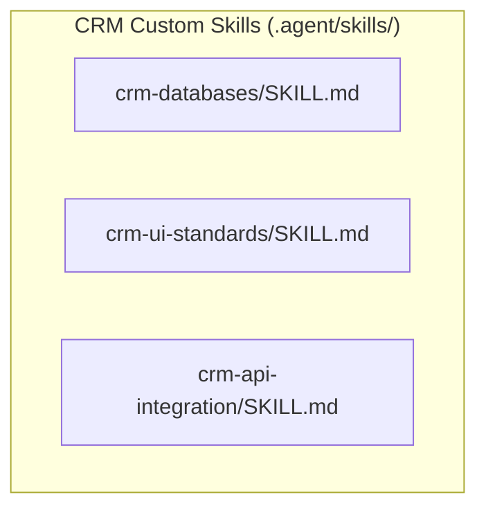

# CRM Custom Skills Implementation Plan

> **For agentic workers:** REQUIRED SUB-SKILL: Use superpowers:subagent-driven-development to implement this plan task-by-task. Steps use checkbox (`- [ ]`) syntax for tracking.

**Goal:** Create three custom agent skills in the `.agent/skills/` directory of the CRM project to guide AI developers in writing consistent database queries, UI components, and API controllers.

**Architecture:** We will define three Markdown-based skills (`crm-databases`, `crm-ui-standards`, and `crm-api-integration`) under `.agent/skills/`. Each skill will have a standard YAML metadata header and detailed guidelines with code patterns.

**Architecture Diagram:**



**Tech Stack:** Markdown, YAML Frontmatter.

---

### Task 1: Create Database Rules Skill
**Files:**
- Create: `.agent/skills/crm-databases/SKILL.md`

- [ ] **Step 1: Write the Database Rules Skill**
  Create the directory `.agent/skills/crm-databases` if it does not exist, and write the `.agent/skills/crm-databases/SKILL.md` file with the following content:
  ```markdown
  ---
  name: crm-databases
  description: Use when querying, modifying, or creating database schema migrations, Prisma models, soft delete filters, and tree relationships in the CRM project
  ---

  # CRM Database Rules

  ## Overview
  Ensures consistent database operations, proper Prisma client usage, soft delete compliance, and hierarchical tree resolutions in the PostgreSQL database.

  ## When to Use
  - Writing raw SQL or Prisma client queries.
  - Adding or modifying tables in `prisma/schema.prisma`.
  - Fetching hierarchical structural data (e.g., organizational units tree).

  ## Core Rules

  ### 1. Prisma Client Import
  - **Do NOT** instantiate new `PrismaClient()`.
  - Always import the shared instance `PRISMA`:
    ```javascript
    import { PRISMA } from "../../configs/db.config.js";
    ```

  ### 2. Table and Field Naming
  - Database tables are mapped to UPPERCASE table names (e.g., `employee` maps to `EMPLOYEES` table).
  - Prisma Client camel-cases the model names (e.g. `model EMPLOYEES` maps to `PRISMA.eMPLOYEES`, and `model ACCOUNTS` maps to `PRISMA.aCCOUNTS`). Keep this casing standard in your Prisma queries.

  ### 3. Soft Delete Compliance
  - **Never** perform hard deletes (`PRISMA.model.delete`).
  - Always perform soft deletes by updating `deletedAt` to the current timestamp and setting `status` to `DISABLED`:
    ```javascript
    await PRISMA.eMPLOYEES.update({
      where: { employeeId },
      data: {
        deletedAt: new Date(),
        status: "DISABLED"
      }
    });
    ```
  - **Always** filter out soft-deleted items and disabled items when querying active data:
    ```javascript
    where: {
      deletedAt: null,
      status: "ENABLE"
    }
    ```

  ### 4. Hierarchical / Tree Queries
  - `ORG_UNITS` can have a parent-child relationship via `parentUnitId` pointing to `orgUnitId`. Use recursive functions or depth-limiting resolvers to query this structure safely and avoid infinite recursion.

  ## Common Mistakes
  - Using `prisma.delete()` directly.
  - Forgetting to filter `deletedAt: null` in query filters.
  ```

- [ ] **Step 2: Commit the Database Rules Skill**
  Run:
  ```bash
  git add .agent/skills/crm-databases/SKILL.md
  git commit -m "feat(skills): add crm-databases rules skill"
  ```

---

### Task 2: Create UI/UX Standards Skill
**Files:**
- Create: `.agent/skills/crm-ui-standards/SKILL.md`

- [ ] **Step 1: Write the UI/UX Standards Skill**
  Create the directory `.agent/skills/crm-ui-standards` if it does not exist, and write the `.agent/skills/crm-ui-standards/SKILL.md` file with the following content:
  ```markdown
  ---
  name: crm-ui-standards
  description: Use when building React components, styling layouts with TailwindCSS, handling routing permissions, and adding animations or UI states in the CRM web project
  ---

  # CRM UI/UX Standards

  ## Overview
  Ensures a modern, premium, and unified interface using React, TailwindCSS, and Redux, with consistent responsive layouts, smooth micro-animations, and permission-aware routing.

  ## When to Use
  - Building or modifying pages in `web/src/pages/`.
  - Designing UI widgets, charts, and tables.
  - Adding animations, dark mode variables, or custom Tailwind classes.

  ## Core Rules

  ### 1. Typography & Colors
  - Use high-quality Google Fonts (e.g., Inter, Roboto, Outfit) instead of default browser sans-serif.
  - Use sleek, curated dark/light HSL palettes (e.g., Slate, Slate-900, Indigo, Emerald) instead of pure raw colors.
  - Keep colors harmonious, using gradients for highlights.

  ### 2. Interactions & Micro-animations
  - Add smooth hover transitions (`transition-all duration-200`) to interactive components (buttons, links, tables, grid elements).
  - Hover states should slightly scale (`hover:scale-[1.01]` or `hover:scale-105`), darken backgrounds, or increase shadows.

  ### 3. Responsive Layout & MainLayout
  - Pages must look premium on viewports ranging from 320px mobile to 1440px+ screens.
  - Use the collapsible `MainLayout` sidebar configuration for the internal panel views.
  - Use card-based grid structures with flex/grid containers.

  ### 4. Page Protection & Navigation Permissions
  - Wrap protected views in the `<ProtectedRoute>` component.
  - If a user lacks the specific permission to access a route, programmatically redirect them to `/not-permission`.

  ## Common Mistakes
  - Hardcoding generic colors (e.g., `bg-red-500`, `text-blue-500`) without matching the theme.
  - Neglecting layout alignment on smaller mobile viewports.
  ```

- [ ] **Step 2: Commit the UI/UX Standards Skill**
  Run:
  ```bash
  git add .agent/skills/crm-ui-standards/SKILL.md
  git commit -m "feat(skills): add crm-ui-standards rules skill"
  ```

---

### Task 3: Create API Integration Skill
**Files:**
- Create: `.agent/skills/crm-api-integration/SKILL.md`

- [ ] **Step 1: Write the API Integration Skill**
  Create the directory `.agent/skills/crm-api-integration` if it does not exist, and write the `.agent/skills/crm-api-integration/SKILL.md` file with the following content:
  ```markdown
  ---
  name: crm-api-integration
  description: Use when designing ExpressJS routes, writing controller classes, implementing services, or configuring JWT authentication and dynamic permissions in the CRM backend
  ---

  # CRM API Integration Rules

  ## Overview
  Ensures that Express controllers, services, authentication middleware, and RBAC follow clean, class-based object-oriented design and standardized response envelopes.

  ## When to Use
  - Building controllers, routes, and services inside `src/modules/`.
  - Adding authorization rules, dynamic permission checks, or JWT handling.
  - Documenting API responses.

  ## Core Rules

  ### 1. Object-Oriented Controller & Service Pattern
  - **Do NOT** export static classes or plain functions.
  - Define classes and export a singleton instance of the controller/service:
    ```javascript
    class CompanyController {
      async list(req, res) {
        // ...
      }
    }
    export const companyController = new CompanyController();
    ```

  ### 2. Authentication & Permission Middleware
  - Protected API routes must chain `authMiddleware` first, then `dynamicPermissionMiddleware` to evaluate permissions against request url and method:
    ```javascript
    router.use(authMiddleware);
    router.use(dynamicPermissionMiddleware);
    ```

  ### 3. Response Standard Envelopes
  - API endpoints must return structured JSON formats:
    - **Success (200/201)**:
      ```json
      {
        "success": true,
        "message": "Retrieval successful",
        "data": { ... }
      }
      ```
    - **Failure (4xx/5xx)**:
      ```json
      {
        "success": false,
        "message": "Invalid parameters",
        "code": "VALIDATION_ERROR"
      }
      ```
  - Always import status codes from the `http-status-codes` library (e.g. `StatusCodes.OK`, `StatusCodes.BAD_REQUEST`).

  ## Common Mistakes
  - Exporting single functions instead of class instances.
  - Hardcoding numeric status codes (e.g. `res.status(200)`).
  ```

- [ ] **Step 2: Commit the API Integration Skill**
  Run:
  ```bash
  git add .agent/skills/crm-api-integration/SKILL.md
  git commit -m "feat(skills): add crm-api-integration rules skill"
  ```
