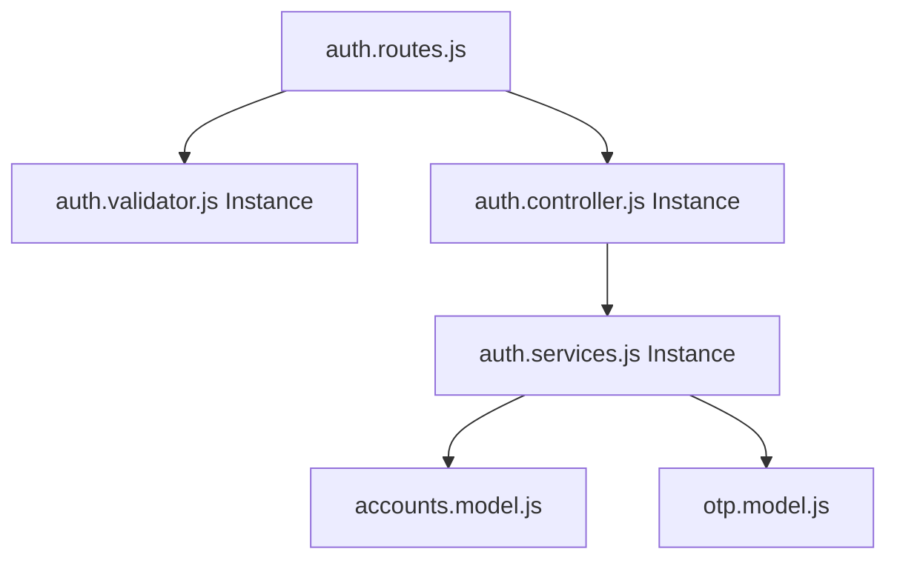

# Dashboard Placeholder and Auth OOP Compliance Implementation Plan

> **For agentic workers:** REQUIRED SUB-SKILL: Use superpowers:subagent-driven-development to implement this plan task-by-task. Steps use checkbox (`- [ ]`) syntax for tracking.

**Goal:** Modify the Dashboard component to display a premium placeholder and refactor the Auth backend module to be OOP class-instance compliant with OTP validation support.

**Architecture:**
- **Frontend Dashboard**: A stunning React view styled with TailwindCSS, containing animated Lucide icons, decorative gradient blur circles, and interactive preview cards for active modules.
- **Backend Auth**: A controller class `AuthController` and a validator class `AuthValidator` that inherit from base validations, instantiate and export singletons, and validate the register fields including OTP checks.

**Architecture Diagram:**

**Tech Stack:** React, TailwindCSS, ExpressJS, Prisma.

---

### Task 1: Refactor Dashboard UI Component

**Files:**
- Modify: `web/src/pages/Dashboard/index.jsx`

- [ ] **Step 1: Replace Dashboard implementation with the premium placeholder view**
  Replace `web/src/pages/Dashboard/index.jsx` with a modern dark HSL glassmorphism view. It will display a development status message, 3 coming-soon cards with micro-animations, and a routing button.

---

### Task 2: Create Auth Validator and Refactor Routes

**Files:**
- Create: `src/modules/auth/auth.validator.js`
- Modify: `src/modules/auth/auth.routes.js`

- [ ] **Step 1: Write auth.validator.js**
  Create the validator class with `register` and `login` methods using `ValidateCores` base validations. Export a singleton instance.
- [ ] **Step 2: Update auth.routes.js**
  Import the validator and controller instances, and bind all methods using `.bind(authController)` and `.bind(authValidator)`.

---

### Task 3: Refactor Auth Controller and Services

**Files:**
- Modify: `src/modules/auth/auth.controller.js`
- Modify: `src/modules/auth/auth.services.js`

- [ ] **Step 1: Update AuthController to use instance methods and export singleton**
  Remove the `static` keyword from all methods, and export the singleton instance `authController`.
- [ ] **Step 2: Update AuthService to support OTP checks and correct registration inputs**
  Update `register` method in `auth.services.js` to extract `email`, `password`, `user_name`, `otp`, `empolyeeCode`, `is_login`. Verify OTP against `OTP_TOKENS` where `otpType = 'REGISTER'`, throw a BAD_REQUEST if invalid/expired, then delete the token.
- [ ] **Step 3: Update login/logout responses**
  Ensure responses follow standard envelopes with HTTP status codes and correct keys.
