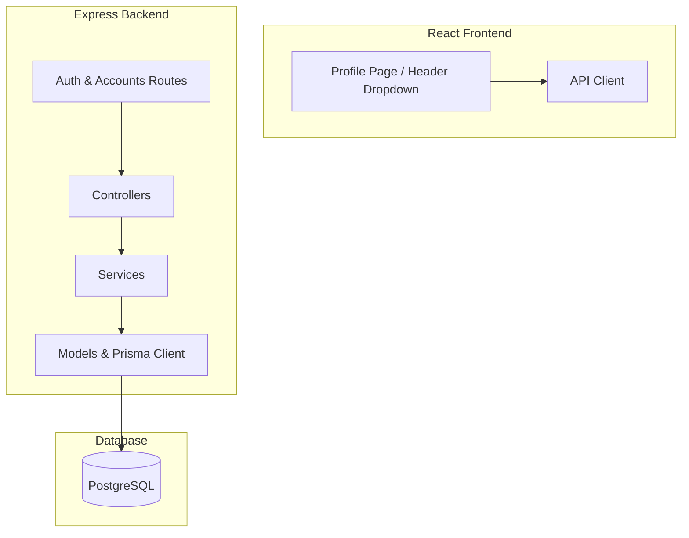

# CRM Mini Completion Implementation Plan

> **For agentic workers:** REQUIRED SUB-SKILL: Use superpowers:subagent-driven-development to implement this plan task-by-task. Steps use checkbox (`- [ ]`) syntax for tracking.

**Goal:** Hoàn thiện các tính năng Xác thực (Đổi mật khẩu), Hồ sơ cá nhân (Profile, Avatar, Cài đặt thông báo) và nâng cấp danh sách tài khoản hỗ trợ phân trang/tìm kiếm ở Database-level.

**Architecture:** 
1. Cập nhật Prisma Schema để thêm trường Avatar và Notification Settings cho model ACCOUNTS.
2. Mở rộng Auth API (change-password, get-profile, update-profile) ở Backend.
3. Cập nhật Model và Service của Accounts ở Backend để hỗ trợ Pagination, Search, Filter qua Prisma.
4. Phát triển trang Profile và tích hợp vào Header của React Frontend.

**Architecture Diagram:**


**Tech Stack:** Node.js, Express, Prisma ORM, PostgreSQL, React, Redux Toolkit, TailwindCSS.

---

### Task 1: Database Schema Update

**Files:**
- Modify: [schema.prisma](file:///d:/Workspase/15.%20Code/crm-mini/prisma/schema.prisma)

- [ ] **Step 1: Modify schema.prisma to add avatar and notificationSettings fields**
  Open `prisma/schema.prisma` and update `model ACCOUNTS` as follows:
  ```diff
    model ACCOUNTS {
      id          String     @unique @map("ID") @db.Uuid
      accountId   Int        @id @default(autoincrement()) @map("ACCOUNT_ID")
      accountName String     @unique(map: "ACCOUNTS_ACCOUNT_CODE_key") @map("ACCOUNT_NAME")
      password    String?    @map("PASSWORD")
      isLogin     Boolean    @default(false) @map("IS_LOGIN")
      login       Int        @default(0) @map("LOGIN")
      description String?    @map("DESCRIPTION") @db.VarChar(255)
      employeeId  Int?       @unique @map("EMPLOYEE_ID")
      status      ENUMSTATUS @default(ENABLE) @map("STATUS")
  +   avatar      String?    @map("AVATAR") @db.VarChar(255)
  +   notificationSettings Json? @map("NOTIFICATION_SETTINGS")
      createdAt   DateTime   @default(now()) @map("CREATED_AT") @db.Timestamp(6)
      updatedAt   DateTime?  @updatedAt @map("UPDATED_AT") @db.Timestamp(6)
      deletedAt   DateTime?  @map("DELETED_AT") @db.Timestamp(6)
  ```

- [ ] **Step 2: Push database schema changes**
  Run: `npx prisma db push`
  Expected: Schema is updated successfully in PostgreSQL.

- [ ] **Step 3: Generate Prisma Client**
  Run: `npx prisma generate`
  Expected: Prisma client code is regenerated.

- [ ] **Step 4: Commit DB changes**
  ```bash
  git add prisma/schema.prisma
  git commit -m "db: add avatar and notificationSettings fields to ACCOUNTS"
  ```

---

### Task 2: Backend Auth API Expansion (Change Password & Profile)

**Files:**
- Modify: [auth.routes.js](file:///d:/Workspase/15.%20Code/crm-mini/src/modules/auth/auth.routes.js)
- Modify: [auth.controller.js](file:///d:/Workspase/15.%20Code/crm-mini/src/modules/auth/auth.controller.js)
- Modify: [auth.services.js](file:///d:/Workspase/15.%20Code/crm-mini/src/modules/auth/auth.services.js)

- [ ] **Step 1: Implement Change Password & Profile Service Methods**
  Modify `src/modules/auth/auth.services.js`:
  ```javascript
  // Add methods inside class AuthServices:
  async changePassword(userId, oldPassword, newPassword) {
    const account = await PRISMA.aCCOUNTS.findFirst({
      where: { accountId: Number(userId), deletedAt: null }
    })
    if (!account) {
      throw new ApiError(StatusCodes.NOT_FOUND, 'Account not found!')
    }
    const isMatch = await bcrypt.compare(oldPassword.trim(), account.password)
    if (!isMatch) {
      throw new ApiError(StatusCodes.BAD_REQUEST, 'Current password is incorrect!')
    }
    if (newPassword.trim().length < 8) {
      throw new ApiError(StatusCodes.BAD_REQUEST, 'New password must be >= 8 characters!')
    }
    const hashedPassword = await bcrypt.hash(newPassword.trim(), saltRoundsPassword)
    await PRISMA.aCCOUNTS.update({
      where: { accountId: account.accountId },
      data: { password: hashedPassword }
    })
    await refreshTokenModel.revokeAllAccountTokens(account.accountId)
    return { success: true }
  }

  async getProfile(userId) {
    const profile = await PRISMA.aCCOUNTS.findFirst({
      where: { accountId: Number(userId), deletedAt: null },
      include: {
        employee: {
          include: {
            orgUnit: {
              include: {
                company: true,
                branch: true
              }
            },
            position: true
          }
        },
        accountRoles: {
          where: { deletedAt: null },
          include: { role: true }
        }
      }
    })
    if (!profile) {
      throw new ApiError(StatusCodes.NOT_FOUND, 'Profile not found!')
    }
    delete profile.password
    return profile
  }

  async updateProfile(userId, profileData) {
    const { firstName, lastName, phone, avatar, notificationSettings } = profileData
    const account = await PRISMA.aCCOUNTS.findFirst({
      where: { accountId: Number(userId), deletedAt: null }
    })
    if (!account) {
      throw new ApiError(StatusCodes.NOT_FOUND, 'Account not found!')
    }
    
    await PRISMA.$transaction(async (tx) => {
      // Update account fields
      await tx.aCCOUNTS.update({
        where: { accountId: account.accountId },
        data: {
          avatar: avatar || null,
          notificationSettings: notificationSettings || undefined
        }
      })

      // Update employee fields if linked
      if (account.employeeId) {
        await tx.eMPLOYEES.update({
          where: { employeeId: account.employeeId },
          data: {
            firstName: firstName || undefined,
            lastName: lastName || undefined,
            phone: phone || null
          }
        })
      }
    })

    return this.getProfile(userId)
  }
  ```

- [ ] **Step 2: Add Controller Endpoints**
  Modify `src/modules/auth/auth.controller.js`:
  ```javascript
  // Add methods inside class AuthController:
  async changePassword(req, res, next) {
    try {
      const userId = req.user.userId
      const { oldPassword, newPassword } = req.body
      await authService.changePassword(userId, oldPassword, newPassword)
      new SuccessResponse({ res, message: 'Password updated successfully. Please log in again.' })
    } catch (error) { next(error) }
  }

  async getProfile(req, res, next) {
    try {
      const userId = req.user.userId
      const data = await authService.getProfile(userId)
      new SuccessResponse({ res, data, message: 'Get profile successfully.' })
    } catch (error) { next(error) }
  }

  async updateProfile(req, res, next) {
    try {
      const userId = req.user.userId
      const data = await authService.updateProfile(userId, req.body)
      new SuccessResponse({ res, data, message: 'Profile updated successfully.' })
    } catch (error) { next(error) }
  }
  ```

- [ ] **Step 3: Define Routes**
  Modify `src/modules/auth/auth.routes.js`:
  ```javascript
  // Add routes inside PROTECTED ROUTES section:
  Router.put('/change-password', authMiddleware, authController.changePassword.bind(authController))
  Router.get('/profile', authMiddleware, authController.getProfile.bind(authController))
  Router.put('/profile', authMiddleware, authController.updateProfile.bind(authController))
  ```

- [ ] **Step 4: Commit backend auth extensions**
  ```bash
  git add src/modules/auth/
  git commit -m "feat: add profile retrieval, profile updates, and password change API endpoints"
  ```

---

### Task 3: Backend Accounts API Pagination & Search

**Files:**
- Modify: [accounts.model.js](file:///d:/Workspase/15.%20Code/crm-mini/src/modules/accounts/accounts.model.js)
- Modify: [accounts.service.js](file:///d:/Workspase/15.%20Code/crm-mini/src/modules/accounts/accounts.service.js)
- Modify: [accounts.controller.js](file:///d:/Workspase/15.%20Code/crm-mini/src/modules/accounts/accounts.controller.js)

- [ ] **Step 1: Update accountsModel.lists to support querying/pagination**
  Modify `src/modules/accounts/accounts.model.js`:
  ```javascript
  async lists(params = {}, includeDeleted = false) {
    const { page = 1, pageSize = 10, search, status, roleId } = params
    const skip = (Number(page) - 1) * Number(pageSize)
    const take = Number(pageSize)

    const prismaWhere = {
      deletedAt: includeDeleted ? undefined : null
    }

    if (status) {
      prismaWhere.status = status
    }

    if (roleId) {
      prismaWhere.accountRoles = {
        some: {
          roleId: Number(roleId),
          deletedAt: null
        }
      }
    }

    if (search && search.trim()) {
      const keyword = search.trim()
      prismaWhere.OR = [
        { accountName: { contains: keyword, mode: 'insensitive' } },
        { description: { contains: keyword, mode: 'insensitive' } }
      ]
    }

    const [total, list] = await Promise.all([
      this.model.count({ where: prismaWhere }),
      this.model.findMany({
        where: prismaWhere,
        skip,
        take,
        orderBy: { accountId: 'asc' },
        include: {
          employee: {
            select: {
              employeeId: true,
              firstName: true,
              lastName: true
            }
          },
          accountRoles: {
            where: { deletedAt: null },
            include: {
              role: true
            }
          }
        }
      })
    ])

    return {
      total,
      list: list.map(item => this._mapResponse(item))
    }
  }
  ```

- [ ] **Step 2: Update accountsService.lists**
  Modify `src/modules/accounts/accounts.service.js`:
  ```javascript
  async lists(params = {}) {
    const result = await accountsModel.lists(params)
    return {
      total: result.total,
      list: Serializer.sanitize(result.list, ['password', 'deletedAt'])
    }
  }
  ```

- [ ] **Step 3: Update accountsController.lists**
  Modify `src/modules/accounts/accounts.controller.js`:
  ```javascript
  async lists(req, res, next) {
    try {
      const result = await accountsService.lists(req.query)
      new SuccessResponse({ res, data: result, message: 'Get accounts list successfully.' })
    } catch (error) { next(error) }
  }
  ```

- [ ] **Step 4: Commit accounts paging updates**
  ```bash
  git add src/modules/accounts/
  git commit -m "feat: add database-level pagination, search, and filtering to Accounts lists API"
  ```

---

### Task 4: Frontend Profile & Settings Integration

**Files:**
- Create: [Profile/index.jsx](file:///d:/Workspase/15.%20Code/crm-mini/web/src/pages/Profile/index.jsx)
- Modify: [routes/index.jsx](file:///d:/Workspase/15.%20Code/crm-mini/web/src/routes/index.jsx)
- Modify: [Header/index.jsx](file:///d:/Workspase/15.%20Code/crm-mini/web/src/components/layouts/Header/index.jsx)

- [ ] **Step 1: Create Profile Component**
  Create `web/src/pages/Profile/index.jsx` with tabs:
  1. Personal Information (Họ tên, SĐT, Email, Phòng ban, Chức vụ, ảnh đại diện).
  2. Change Password (Mật khẩu cũ, mật khẩu mới, xác nhận mật khẩu).
  3. Settings (Nhận thông báo qua Email).
  *(Make sure design is premium using subtle grid layouts, Tailwind colors, custom shadows).*

- [ ] **Step 2: Add Route to routes/index.jsx**
  Import Profile and add path `profile` inside `routes/index.jsx`.
  ```javascript
  const Profile = lazy(() => import("@/pages/Profile"));
  // Inside children of main "/" route:
  {
    path: "profile",
    element: (
      <WithSpinner>
        <Profile />
      </WithSpinner>
    )
  }
  ```

- [ ] **Step 3: Update Header Menu Dropdown**
  Add "Hồ sơ cá nhân" navigation route in dropdown of `web/src/components/layouts/Header/index.jsx`:
  ```jsx
  <button
    type="button"
    role="menuitem"
    className="flex w-full items-center gap-2 rounded-lg px-4 py-2.5 text-left text-sm text-slate-700 hover:bg-slate-50 cursor-pointer transition-colors"
    onClick={() => {
      setOpen(false)
      navigate('/profile')
    }}
  >
    <User size={16} />
    Hồ sơ cá nhân
  </button>
  ```

- [ ] **Step 4: Commit Frontend Profile integration**
  ```bash
  git add web/src/
  git commit -m "feat: implement profile component, routing, and header link"
  ```
