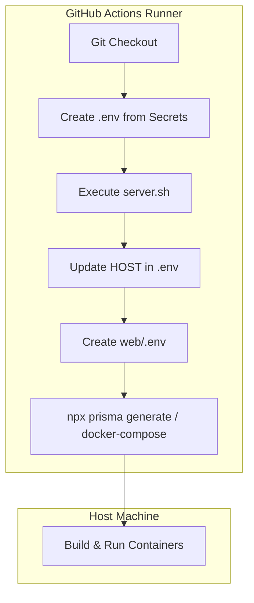

# Dynamic .env Generation in GitHub Actions Implementation Plan

> **For agentic workers:** REQUIRED SUB-SKILL: Use superpowers:subagent-driven-development to implement this plan task-by-task. Steps use checkbox (`- [ ]`) syntax for tracking.

**Goal:** Create environment configuration files (`.env` and `web/.env`) dynamically in the GitHub Actions workflow using repository Secrets and running the `server.sh` script to get the host's IP address.

**Architecture:** We will inject step blocks inside `.github/workflows/action.yml` for the `setup` and `deploy` jobs. These steps will dynamically construct the `.env` using GitHub repository secrets, run `server.sh` to update the `HOST` IP, and create `web/.env` with frontend defaults.

**Architecture Diagram:**

**Tech Stack:** GitHub Actions, Bash, Docker Compose

---

### Task 1: Update .github/workflows/action.yml

**Files:**
- Modify: `[action.yml](file:///d:/Workspase/15. Code/crm-mini/.github/workflows/action.yml)`

- [ ] **Step 1: Inject Create .env files step in setup job**
  Modify `.github/workflows/action.yml` to insert the environment generation step right after checkout.

- [ ] **Step 2: Inject Create .env files step in deploy job**
  Modify `.github/workflows/action.yml` to insert the environment generation step right after checkout.

- [ ] **Step 3: Verify workflow syntax and commit**
