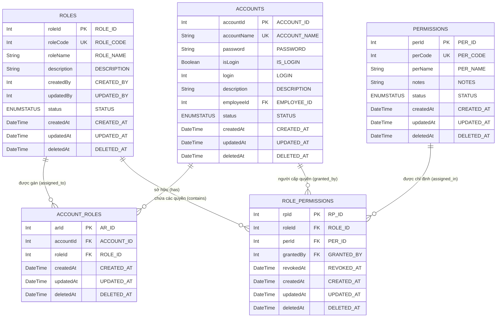
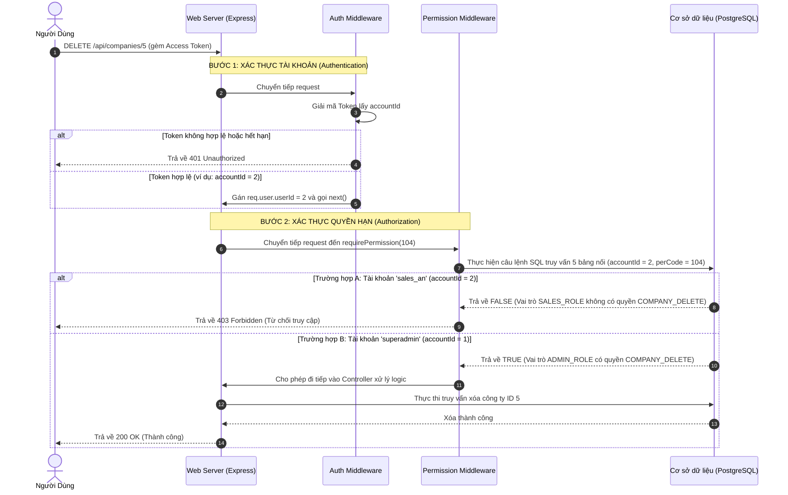

# HỆ THỐNG PHÂN QUYỀN (RBAC - ROLE-BASED ACCESS CONTROL)

Tài liệu này mô tả chi tiết về cấu trúc cơ sở dữ liệu, quy trình khởi tạo dữ liệu mẫu (Seed Data), và logic kiểm tra quyền hạn (Authorization Logic) phục vụ cho tính năng phân quyền trong hệ thống CRM-Mini.

---

## 1. Sơ Đồ Quan Hệ Thực Thể (ERD - Entity Relationship Diagram)

Dưới đây là sơ đồ quan hệ giữa các thực thể chính tham gia vào quy trình phân quyền bao gồm: **ACCOUNTS**, **ACCOUNT_ROLES**, **ROLES**, **ROLE_PERMISSIONS**, và **PERMISSIONS**.



---

## 2. Quy Trình Khởi Tạo & Chèn Dữ Liệu Mẫu (Seed Data)

Do các ràng buộc khóa ngoại vật lý trong cơ sở dữ liệu PostgreSQL, dữ liệu mẫu cần được chèn theo đúng thứ tự ưu tiên dưới đây để tránh lỗi ràng buộc toàn vẹn dữ liệu:

### Bước 1: Tạo danh mục quyền tĩnh (PERMISSIONS)
*Quyền không phụ thuộc vào bất kỳ bảng nào khác trong hệ thống phân quyền.*

```sql
INSERT INTO "PERMISSIONS" ("ID", "PER_ID", "PER_CODE", "PER_NAME", "STATUS")
VALUES 
  (gen_random_uuid(), 1, 101, 'COMPANY_VIEW', 'ENABLE'),
  (gen_random_uuid(), 2, 104, 'COMPANY_DELETE', 'ENABLE');
```

### Bước 2: Tạo các vai trò hệ thống (ROLES)
*Vai trò không trực tiếp liên kết khóa ngoại với các thực thể phân quyền khác khi chèn cơ bản.*

```sql
INSERT INTO "ROLES" ("ID", "ROLE_ID", "ROLE_CODE", "ROLE_NAME", "STATUS")
VALUES 
  (gen_random_uuid(), 1, 1001, 'ADMIN_ROLE', 'ENABLE'),
  (gen_random_uuid(), 2, 1002, 'SALES_ROLE', 'ENABLE');
```

### Bước 3: Tạo tài khoản quản trị & nhân viên (ACCOUNTS)
*Tài khoản cần tồn tại trước khi làm người cấp quyền (grantedBy).*

```sql
INSERT INTO "ACCOUNTS" ("ID", "ACCOUNT_ID", "ACCOUNT_NAME", "PASSWORD", "STATUS")
VALUES 
  (gen_random_uuid(), 1, 'superadmin', 'hashed_pwd_1', 'ENABLE'),
  (gen_random_uuid(), 2, 'sales_an', 'hashed_pwd_2', 'ENABLE');
```

### Bước 4: Thiết lập liên kết giữa vai trò và quyền (ROLE_PERMISSIONS)
*Bảng trung gian ánh xạ nhiều-nhiều giữa ROLES và PERMISSIONS, ghi nhận ai cấp quyền.*

```sql
-- Cấp cả quyền Xem và Xóa cho nhóm ADMIN_ROLE (roleId = 1)
INSERT INTO "ROLE_PERMISSIONS" ("ID", "RP_ID", "ROLE_ID", "PER_ID", "GRANTED_BY")
VALUES 
  (gen_random_uuid(), 1, 1, 1, 1),
  (gen_random_uuid(), 2, 1, 2, 1);

-- Chỉ cấp duy nhất quyền Xem cho nhóm SALES_ROLE (roleId = 2)
INSERT INTO "ROLE_PERMISSIONS" ("ID", "RP_ID", "ROLE_ID", "PER_ID", "GRANTED_BY")
VALUES 
  (gen_random_uuid(), 3, 2, 1, 1);
```

### Bước 5: Gán vai trò cho tài khoản người dùng (ACCOUNT_ROLES)
*Ánh xạ nhiều-nhiều giữa ACCOUNTS và ROLES.*

```sql
-- Gán vai trò ADMIN_ROLE cho tài khoản superadmin (accountId = 1)
INSERT INTO "ACCOUNT_ROLES" ("ID", "AR_ID", "ROLE_ID", "ACCOUNT_ID")
VALUES 
  (gen_random_uuid(), 1, 1, 1);

-- Gán vai trò SALES_ROLE cho tài khoản sales_an (accountId = 2)
INSERT INTO "ACCOUNT_ROLES" ("ID", "AR_ID", "ROLE_ID", "ACCOUNT_ID")
VALUES 
  (gen_random_uuid(), 2, 2, 2);
```

---

## 3. Logic Truy Vấn Kiểm Tra Quyền Hạn (Authorization Logic)

Để xác thực một tài khoản (`accountId`) có sở hữu một mã quyền cụ thể (`perCode`) hay không, hệ thống sẽ thực hiện truy vấn thông qua quan hệ nối 5 bảng.

### Các điều kiện ràng buộc trạng thái hoạt động:
*   **Trạng thái kích hoạt**: Các bảng `ACCOUNTS`, `ROLES`, `PERMISSIONS` phải có `status = 'ENABLE'`.
*   **Không bị xóa mềm**: Các bảng `ACCOUNTS`, `ACCOUNT_ROLES`, `ROLES`, `ROLE_PERMISSIONS`, `PERMISSIONS` phải có `deletedAt = null`.
*   **Không bị thu hồi quyền**: Bảng `ROLE_PERMISSIONS` phải thỏa mãn điều kiện `revokedAt = null` hoặc `revokedAt > new Date()` (chưa đến thời hạn bị thu hồi).

---

### Cách 1: Truy vấn trực tiếp bằng SQL (PostgreSQL)

```sql
SELECT EXISTS (
    SELECT 1 
    FROM "ACCOUNTS" a
    JOIN "ACCOUNT_ROLES" ar ON a."ACCOUNT_ID" = ar."ACCOUNT_ID"
    JOIN "ROLES" r ON ar."ROLE_ID" = r."ROLE_ID"
    JOIN "ROLE_PERMISSIONS" rp ON r."ROLE_ID" = rp."ROLE_ID"
    JOIN "PERMISSIONS" p ON rp."PER_ID" = p."PER_ID"
    WHERE a."ACCOUNT_ID" = :accountId
      AND p."PER_CODE" = :perCode
      AND a."STATUS" = 'ENABLE' AND a."DELETED_AT" IS NULL
      AND ar."DELETED_AT" IS NULL
      AND r."STATUS" = 'ENABLE' AND r."DELETED_AT" IS NULL
      AND rp."DELETED_AT" IS NULL 
      AND (rp."REVOKED_AT" IS NULL OR rp."REVOKED_AT" > CURRENT_TIMESTAMP)
      AND p."STATUS" = 'ENABLE' AND p."DELETED_AT" IS NULL
);
```

---

### Cách 2: Truy vấn thông qua Prisma Client

Sử dụng tính năng truy vấn lồng liên kết của Prisma để tối ưu hóa hiệu năng và kiểm tra quyền một cách tinh gọn:

```javascript
import { PRISMA } from '../../configs/db.config.js';

/**
 * Kiểm tra tài khoản có sở hữu mã quyền cụ thể hay không
 * @param {number} accountId - ID của tài khoản cần kiểm tra
 * @param {number} perCode - Mã quyền tĩnh cần kiểm tra (ví dụ: 101, 104)
 * @returns {Promise<boolean>}
 */
export const checkAccountPermission = async (accountId, perCode) => {
  const accountWithPermission = await PRISMA.aCCOUNTS.findFirst({
    where: {
      accountId: Number(accountId),
      status: 'ENABLE',
      deletedAt: null,
      accountRoles: {
        some: {
          deletedAt: null,
          role: {
            status: 'ENABLE',
            deletedAt: null,
            rolePermissions: {
              some: {
                deletedAt: null,
                OR: [
                  { revokedAt: null },
                  { revokedAt: { gt: new Date() } }
                ],
                permission: {
                  perCode: Number(perCode),
                  status: 'ENABLE',
                  deletedAt: null
                }
              }
            }
          }
        }
      }
    },
    select: {
      accountId: true
    }
  });

  return !!accountWithPermission;
};
```

---

### Cách 3: Ứng dụng làm Middleware phân quyền trong API (ExpressJS)

Bạn có thể viết một middleware dùng chung để kiểm soát quyền truy cập của các route như sau:

```javascript
import { checkAccountPermission } from './path_to_permission_helper.js';
import { StatusCodes } from 'http-status-codes';

/**
 * Middleware yêu cầu tài khoản có mã quyền cụ thể
 * @param {number} requiredPerCode - Mã quyền yêu cầu (ví dụ: 101)
 */
export const requirePermission = (requiredPerCode) => {
  return async (req, res, next) => {
    try {
      const accountId = req.user?.userId; // Lấy từ authMiddleware đã xác thực trước đó

      if (!accountId) {
        return res.status(StatusCodes.UNAUTHORIZED).json({
          success: false,
          message: 'Tài khoản chưa được xác thực hoặc không hợp lệ.'
        });
      }

      const isAuthorized = await checkAccountPermission(accountId, requiredPerCode);

      if (!isAuthorized) {
        return res.status(StatusCodes.FORBIDDEN).json({
          success: false,
          message: 'Tài khoản không có quyền thực hiện chức năng này.'
        });
      }

      next();
    } catch (error) {
      console.error('Permission Middleware Error:', error);
      return res.status(StatusCodes.INTERNAL_SERVER_ERROR).json({
        success: false,
        message: 'Lỗi hệ thống khi kiểm tra quyền hạn.'
      });
    }
  };
};
```

*Sử dụng middleware trong cấu hình router:*
```javascript
import { Router } from 'express';
import { authMiddleware } from '../middleware/auth.middleware.js';
import { requirePermission } from '../middleware/permission.middleware.js';

const router = Router();

// Route chỉ dành cho tài khoản có quyền COMPANY_VIEW (101)
router.get('/companies', authMiddleware, requirePermission(101), companyController.list);

// Route chỉ dành cho tài khoản có quyền COMPANY_DELETE (104)
router.delete('/companies/:id', authMiddleware, requirePermission(104), companyController.delete);
```

---

## 4. Ví Dụ Thực Tế Quy Trình Phân Quyền (Real-world Workflow Example)

Để dễ hình dung cách hệ thống phân quyền vận hành, dưới đây là kịch bản chạy thực tế khi người dùng gửi yêu cầu API.

### Kịch bản: Yêu cầu Xóa một Công ty (`DELETE /api/companies/5`)
*   **Mã quyền yêu cầu bảo vệ route này**: `104` (tương ứng với `COMPANY_DELETE`).



### Chi tiết các bước xử lý trong Database của Trường hợp A (Tài khoản `sales_an` bị từ chối):

1.  **Hệ thống tìm tài khoản của An**: Nhận diện `accountId = 2` (tên tài khoản `sales_an`), trạng thái `ENABLE` và chưa bị xóa mềm.
2.  **Tìm vai trò của An**: Tra cứu bảng `ACCOUNT_ROLES` với `accountId = 2`, tìm thấy vai trò có `roleId = 2` (tương ứng vai trò `SALES_ROLE` trong bảng `ROLES`).
3.  **Kiểm tra danh mục quyền của vai trò**: Tra cứu bảng `ROLE_PERMISSIONS` với `roleId = 2`.
    -   Tìm thấy bản ghi liên kết: `roleId = 2` đi kèm với `perId = 1` (Mã quyền `101` - `COMPANY_VIEW`).
    -   Không tìm thấy bản ghi liên kết nào đi kèm với `perId = 2` (Mã quyền `104` - `COMPANY_DELETE`).
4.  **Kết luận**: Tài khoản `sales_an` không sở hữu mã quyền `104` $\rightarrow$ Từ chối truy cập API và trả về lỗi **403 Forbidden**.

---

## 5. Hướng Dẫn Thêm Mới Một Quyền Hạn (Ví dụ: Quyền Sửa Công Ty - `COMPANY_EDIT`)

Khi bạn muốn thêm một chức năng mới cần được bảo vệ bằng hệ thống phân quyền (ví dụ: Quyền Sửa Công Ty - `COMPANY_EDIT` với mã quyền `102`), bạn sẽ thực hiện theo 3 bước sau:

### Bước 1: Khai báo Quyền Mới trong Cơ sở dữ liệu (`PERMISSIONS`)
Chèn bản ghi định nghĩa quyền vào bảng danh mục quyền tĩnh:
```sql
INSERT INTO "PERMISSIONS" ("ID", "PER_ID", "PER_CODE", "PER_NAME", "STATUS")
VALUES 
  (gen_random_uuid(), 3, 102, 'COMPANY_EDIT', 'ENABLE');
```

---

### Bước 2: Cấp quyền này cho các Vai trò mong muốn (`ROLE_PERMISSIONS`)
Ví dụ: 
*   Cấp quyền sửa (`COMPANY_EDIT` - `perId = 3`) cho vai trò quản trị viên `ADMIN_ROLE` (`roleId = 1`).
*   Cấp quyền sửa (`COMPANY_EDIT` - `perId = 3`) cho vai trò nhân viên bán hàng `SALES_ROLE` (`roleId = 2`).

```sql
-- Cấp quyền COMPANY_EDIT cho ADMIN_ROLE
INSERT INTO "ROLE_PERMISSIONS" ("ID", "RP_ID", "ROLE_ID", "PER_ID", "GRANTED_BY")
VALUES (gen_random_uuid(), 4, 1, 3, 1); -- Được cấp bởi superadmin (accountId = 1)

-- Cấp quyền COMPANY_EDIT cho SALES_ROLE
INSERT INTO "ROLE_PERMISSIONS" ("ID", "RP_ID", "ROLE_ID", "PER_ID", "GRANTED_BY")
VALUES (gen_random_uuid(), 5, 2, 3, 1); -- Được cấp bởi superadmin (accountId = 1)
```

---

### Bước 3: Áp dụng kiểm tra quyền tại Router API Backend (Node.js/Express)
Sử dụng middleware `requirePermission` với mã quyền vừa tạo là `102` để bảo vệ route cập nhật thông tin công ty:

```javascript
import { Router } from 'express';
import { authMiddleware } from '../middleware/auth.middleware.js';
import { requirePermission } from '../middleware/permission.middleware.js';
import { companyController } from '../controllers/company.controller.js';

const router = Router();

// Route Cập nhật thông tin công ty - yêu cầu quyền COMPANY_EDIT (102)
router.put(
  '/companies/:id', 
  authMiddleware, 
  requirePermission(102), // <-- Kiểm tra quyền edit tại đây
  companyController.update
);
```

Như vậy, cả tài khoản thuộc nhóm `ADMIN_ROLE` và `SALES_ROLE` đều sẽ thực hiện sửa được, còn các tài khoản thuộc nhóm vai trò khác (nếu có) sẽ bị chặn ngay từ lớp Middleware.

---

## 6. Thiết Kế Giải Pháp Phân Quyền Động (Dynamic Authorization - Không Cần Sửa Code)

Để quản trị viên có thể tạo mới quyền, liên kết quyền cho các vai trò thông qua giao diện quản trị (Admin Dashboard) mà **không cần chỉnh sửa code backend** hay **không cần khởi động lại ứng dụng**, hệ thống sẽ chuyển đổi cơ chế kiểm tra từ mã số cứng sang **so khớp động dựa trên HTTP Method và API Path**.

### Bước 1: Điều chỉnh bảng `PERMISSIONS` trong Cơ sở dữ liệu
Bổ sung hai trường `apiPath` và `method` vào thực thể để lưu trữ tài nguyên và hành động tương ứng:

```prisma
model PERMISSIONS {
  id              String             @unique @map("ID") @db.Uuid
  perId           Int                @id @default(autoincrement()) @map("PER_ID")
  perCode         Int                @unique @map("PER_CODE")
  perName         String             @map("PER_NAME")
  apiPath         String             @map("API_PATH") // Ví dụ: "/api/companies" hoặc "/api/companies/:id"
  method          String             @map("METHOD")   // Ví dụ: "GET", "POST", "PUT", "DELETE"
  notes           String?            @map("NOTES")
  status          ENUMSTATUS         @default(ENABLE) @map("STATUS")
  createdAt       DateTime           @default(now()) @map("CREATED_AT") @db.Timestamp(6)
  updatedAt       DateTime?          @updatedAt @map("UPDATED_AT") @db.Timestamp(6)
  deletedAt       DateTime?          @map("DELETED_AT") @db.Timestamp(6)

  rolePermissions ROLE_PERMISSIONS[]

  @@map("PERMISSIONS")
}
```

---

### Bước 2: Xây dựng Dynamic Authorization Middleware
Middleware này sẽ tự động lấy thông tin từ request hiện tại (`req.baseUrl`, `req.path`, `req.method`) để đối sánh với các quyền đang hoạt động của người dùng trong cơ sở dữ liệu:

```javascript
import { PRISMA } from '../../configs/db.config.js';
import { StatusCodes } from 'http-status-codes';

/**
 * Middleware phân quyền động - Khớp chính xác API Path và HTTP Method
 */
export const dynamicPermissionMiddleware = async (req, res, next) => {
  try {
    const accountId = req.user?.userId; // Lấy từ authMiddleware đã xác thực trước đó
    const currentPath = req.baseUrl + req.path; // Ví dụ: "/api/companies/5"
    const currentMethod = req.method;          // Ví dụ: "PUT"

    if (!accountId) {
      return res.status(StatusCodes.UNAUTHORIZED).json({
        success: false,
        message: 'Tài khoản chưa được xác thực.'
      });
    }

    // 1. Lấy tài khoản kèm theo tất cả các permissions đang ENABLE và không bị xóa mềm
    const accountData = await PRISMA.aCCOUNTS.findFirst({
      where: {
        accountId: Number(accountId),
        status: 'ENABLE',
        deletedAt: null,
        accountRoles: {
          some: {
            deletedAt: null,
            role: {
              status: 'ENABLE',
              deletedAt: null,
              rolePermissions: {
                some: {
                  deletedAt: null,
                  OR: [
                    { revokedAt: null },
                    { revokedAt: { gt: new Date() } }
                  ],
                  permission: {
                    status: 'ENABLE',
                    deletedAt: null
                  }
                }
              }
            }
          }
        }
      },
      include: {
        accountRoles: {
          where: { deletedAt: null },
          include: {
            role: {
              include: {
                rolePermissions: {
                  where: {
                    deletedAt: null,
                    OR: [
                      { revokedAt: null },
                      { revokedAt: { gt: new Date() } }
                    ]
                  },
                  include: {
                    permission: true
                  }
                }
              }
            }
          }
        }
      }
    });

    if (!accountData) {
      return res.status(StatusCodes.FORBIDDEN).json({
        success: false,
        message: 'Tài khoản không có quyền hạn hoạt động trong hệ thống.'
      });
    }

    // Trích xuất phẳng toàn bộ PERMISSIONS từ các vai trò mà tài khoản sở hữu
    const userPermissions = accountData.accountRoles
      .flatMap(ar => ar.role.rolePermissions)
      .map(rp => rp.permission);

    // 2. So khớp Regex động giữa URL đang gọi và API_PATH đã định nghĩa trong DB
    const hasPermission = userPermissions.some(permission => {
      // Chuyển /api/companies/:id hoặc /api/companies/:companyId thành regex /api/companies/[^\s/]+
      const pathPattern = permission.apiPath.replace(/:[^\s/]+/g, '[^\\s/]+');
      const regExp = new RegExp(`^${pathPattern}$`);

      const methodMatches = permission.method.toUpperCase() === currentMethod.toUpperCase();
      const pathMatches = regExp.test(currentPath);

      return methodMatches && pathMatches;
    });

    if (!hasPermission) {
      return res.status(StatusCodes.FORBIDDEN).json({
        success: false,
        message: 'Tài khoản không được cấp phép thực hiện hành động này trên tài nguyên.'
      });
    }

    next();
  } catch (error) {
    console.error('Dynamic Authorization Error:', error);
    return res.status(StatusCodes.INTERNAL_SERVER_ERROR).json({
      success: false,
      message: 'Lỗi hệ thống khi kiểm tra quyền hạn.'
    });
  }
};
```

---

### Bước 3: Áp dụng trên Router duy nhất một lần
Giờ đây, bạn chỉ cần gọi middleware động này một lần duy nhất bao ngoài các route API cần phân quyền:

```javascript
import { Router } from 'express';
import { authMiddleware } from '../middleware/auth.middleware.js';
import { dynamicPermissionMiddleware } from '../middleware/dynamicPermission.middleware.js';
import { companyController } from '../controllers/company.controller.js';

const router = Router();

// Áp dụng xác thực danh tính & tự động khớp quyền cho TẤT CẢ các route bên dưới
router.use(authMiddleware);
router.use(dynamicPermissionMiddleware);

router.get('/companies', companyController.list);
router.post('/companies', companyController.create);
router.put('/companies/:id', companyController.update);
router.delete('/companies/:id', companyController.delete);
```

---

### Quy trình khi Quản trị viên (Admin) tạo mới quyền trên giao diện:
1.  **Bước 1**: Admin thêm quyền mới trên UI:
    *   Tên quyền: `Sửa thông tin công ty`
    *   API Path: `/api/companies/:id`
    *   HTTP Method: `PUT`
    *   Mã quyền (perCode): `102`
    *(UI sẽ gọi API `POST /api/permissions` để lưu vào bảng `PERMISSIONS`)*
2.  **Bước 2**: Admin chọn cấu hình vai trò `SALES_ROLE` và bật nút kích hoạt cho quyền `Sửa thông tin công ty` vừa tạo.
    *(UI sẽ gọi API `POST /api/roles/:roleId/permissions` gán liên kết vào bảng `ROLE_PERMISSIONS`)*

**Kết quả**: Hệ thống backend tự động bảo vệ route `PUT /api/companies/:id` dựa trên quyền hạn mới cấp này ngay lập tức. Người dùng thuộc nhóm `SALES_ROLE` có thể bắt đầu sử dụng API, các vai trò khác sẽ bị chặn hoàn toàn mà **không cần can thiệp vào code hay db thủ công**.


